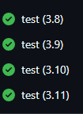
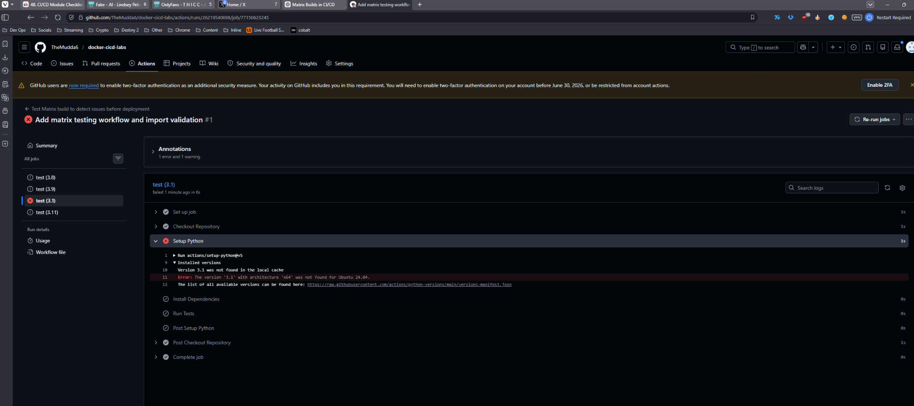
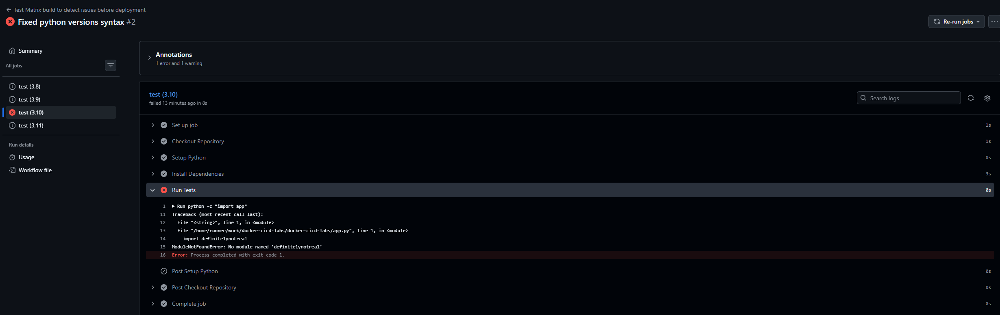
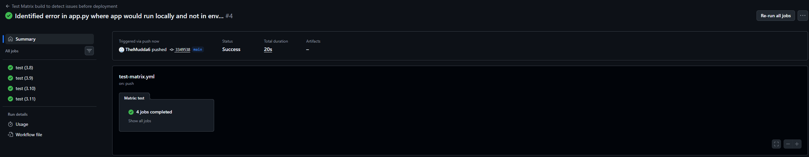

# Docker CI/CD Flask Application

## Overview

This project demonstrates a complete CI/CD workflow using:
- Python Flask
- Docker
- GitHub Actions
- Docker Hub

The pipeline automatically:
- builds Docker images
- authenticates securely using GitHub Secrets
- pushes images to Docker Hub

---

# Technologies Used

- Python
- Flask
- Docker
- GitHub Actions
- Docker Hub
- Linux (WSL Ubuntu)
- Git

---

# CI/CD Workflow Architecture

Developer Push
    ↓
GitHub Actions Workflow
    ↓
Docker Image Build
    ↓
Docker Hub Authentication
    ↓
Automatic Docker Push

---

# Project Screenshots

## Flask Application Code


---

## Dockerfile


---

## Successful Docker Build


---

## Running Docker Container


---

## Flask Application Running


---

## GitHub Actions CI/CD Pipeline


---

## Docker Hub Published Image


---

# Key Concepts Learned

- Docker containerization
- Docker image layering
- Port mapping
- GitHub Actions automation
- CI/CD workflows
- Docker Hub integration
- GitHub Secrets
- Personal Access Tokens (PATs)
- Linux/WSL development environments
- Secure authentication practices

---

# Lessons Learned

One of the biggest takeaways from this project was understanding how CI/CD pipelines improve:
- automation
- consistency
- deployment reliability
- reproducibility

while reducing:
- human error
- deployment inconsistencies
- “works on my machine” problems.

This project also provided hands-on experience troubleshooting:
- GitHub Actions failures
- Docker authentication issues
- Git repository configuration
- environment standardization between WSL and VS Code

---

# Future Improvements

- Add automated testing
- Add Docker Compose
- Add Kubernetes deployment
- Add Terraform infrastructure provisioning
- Add automated security scanning

---

# Matrix Builds & CI Validation

The CI/CD pipeline was expanded with a GitHub Actions matrix testing workflow to improve application validation across multiple Python environments.

The workflow now automatically tests the Flask application against:

- Python 3.8
- Python 3.9
- Python 3.10
- Python 3.11

This helps improve:
- compatibility validation
- deployment confidence
- environment consistency
- early failure detection

while reducing the risk of:
- dependency incompatibilities
- runtime environment issues
- broken production deployments

---

# Updated CI Workflow Architecture

Developer Push
    ↓
GitHub Actions Matrix Workflow
    ↓
Parallel Python Version Testing
    ↓
Dependency Installation
    ↓
Flask Import Validation
    ↓
Docker Build & Deployment Readiness

---

# Matrix Testing Workflow Overview



---

# CI/CD Debugging & Failure Injection

To better understand CI/CD behavior and validation workflows, intentional failures were introduced and debugged during development.

This included:
- YAML version parsing issues
- import validation failures
- Flask application startup behavior
- CI pipeline hanging caused by improper application entrypoints

These exercises helped reinforce real-world DevOps concepts such as:
- validation gates
- observability
- process lifecycle management
- controlled failure testing
- sequential failure discovery

---

# YAML Version Parsing Issue

During matrix testing, YAML automatically interpreted:

```yaml
3.10
```

as:

```yaml
3.1
```

This caused GitHub Actions to fail during Python setup because the requested runtime version did not exist.

The issue was resolved by converting the matrix versions into explicit strings:

```yaml
["3.8", "3.9", "3.10", "3.11"]
```

## Workflow Failure Example



---

# Import Validation Failure Testing

An intentional import failure was introduced using a fake dependency to validate that the CI pipeline correctly detected broken application startup conditions.

The workflow successfully:
- stopped execution
- surfaced detailed logs
- prevented further deployment stages

This demonstrated how CI/CD pipelines act as protection mechanisms against broken application releases.

## Import Validation Failure



---

# Flask Entrypoint Debugging

During import validation testing, the Flask server initially caused the GitHub Actions runner to hang indefinitely.

This occurred because:

```python
app.run()
```

executed automatically during module import.

The issue was resolved using:

```python
if __name__ == "__main__":
```

which ensured the Flask server only starts during direct execution rather than during CI import validation.

This reinforced important concepts around:
- Python module behavior
- process lifecycle management
- CI-safe application design

---

# Successful Matrix Workflow Validation

After resolving the validation and application entrypoint issues, the matrix workflow completed successfully across all supported Python versions.

## Successful Workflow Execution



---

# Additional Concepts Learned

- GitHub Actions matrix strategies
- Parallel CI job execution
- Multi-version compatibility testing
- Import/startup validation
- YAML parsing pitfalls
- CI process lifecycle management
- Application entrypoint safety
- Failure isolation and remediation
- Observability and debugging in CI/CD systems
