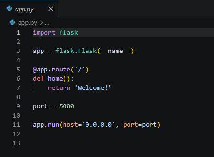
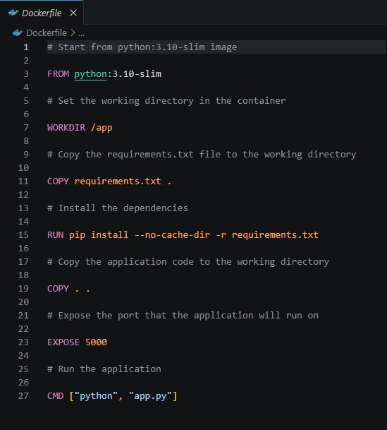
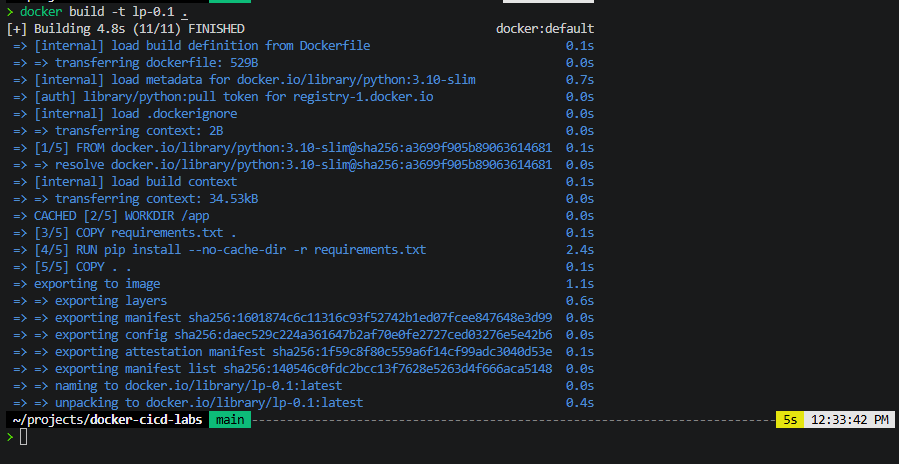
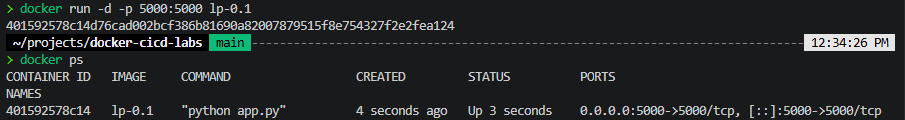
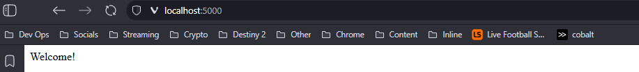
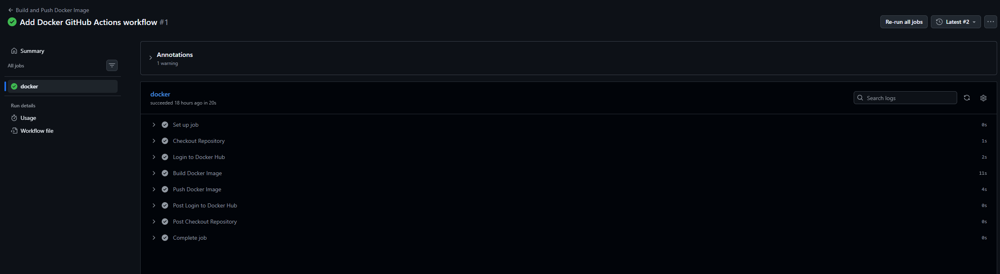
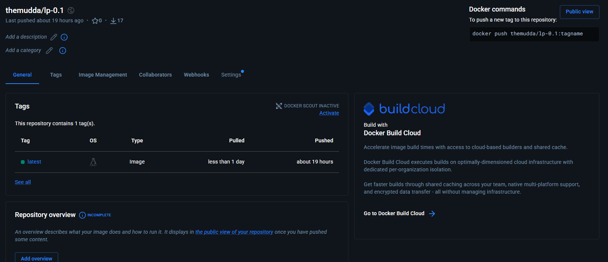

# Docker CI/CD Flask Application

## Overview

This project demonstrates a complete CI/CD workflow using:
- Python Flask
- Docker
- GitHub Actions
- Docker Hub

The pipeline automatically:
- builds Docker images
- authenticates securely using GitHub Secrets
- pushes images to Docker Hub

---

# Technologies Used

- Python
- Flask
- Docker
- GitHub Actions
- Docker Hub
- Linux (WSL Ubuntu)
- Git

---

# CI/CD Workflow Architecture

Developer Push
    ↓
GitHub Actions Workflow
    ↓
Docker Image Build
    ↓
Docker Hub Authentication
    ↓
Automatic Docker Push

---

# Project Screenshots

## Flask Application Code

---

## Dockerfile

---

## Successful Docker Build

---

## Running Docker Container

---

## Flask Application Running

---

## GitHub Actions CI/CD Pipeline

---

## Docker Hub Published Image

---

# Key Concepts Learned

- Docker containerization
- Docker image layering
- Port mapping
- GitHub Actions automation
- CI/CD workflows
- Docker Hub integration
- GitHub Secrets
- Personal Access Tokens (PATs)
- Linux/WSL development environments
- Secure authentication practices

---

# Lessons Learned

One of the biggest takeaways from this project was understanding how CI/CD pipelines improve:
- automation
- consistency
- deployment reliability
- reproducibility

while reducing:
- human error
- deployment inconsistencies
- “works on my machine” problems.

This project also provided hands-on experience troubleshooting:
- GitHub Actions failures
- Docker authentication issues
- Git repository configuration
- environment standardization between WSL and VS Code

---

# Future Improvements

- Add automated testing
- Add Docker Compose
- Add Kubernetes deployment
- Add Terraform infrastructure provisioning
- Add automated security scanning
