# Docker CI/CD Flask Application

## Overview

This project demonstrates a complete CI/CD workflow using:
- Python Flask
- Docker
- GitHub Actions
- Docker Hub

The pipeline automatically:
- builds Docker images
- authenticates securely using GitHub Secrets
- pushes images to Docker Hub

---

# Technologies Used

- Python
- Flask
- Docker
- GitHub Actions
- Docker Hub
- Linux (WSL Ubuntu)
- Git

---

# CI/CD Workflow Architecture

Developer Push
    ↓
GitHub Actions Workflow
    ↓
Docker Image Build
    ↓
Docker Hub Authentication
    ↓
Automatic Docker Push

---

# Project Screenshots

## Flask Application Code


---

## Dockerfile


---

## Successful Docker Build


---

## Running Docker Container


---

## Flask Application Running


---

## GitHub Actions CI/CD Pipeline


---

## Docker Hub Published Image


---

# Key Concepts Learned

- Docker containerization
- Docker image layering
- Port mapping
- GitHub Actions automation
- CI/CD workflows
- Docker Hub integration
- GitHub Secrets
- Personal Access Tokens (PATs)
- Linux/WSL development environments
- Secure authentication practices

---

# Lessons Learned

One of the biggest takeaways from this project was understanding how CI/CD pipelines improve:
- automation
- consistency
- deployment reliability
- reproducibility

while reducing:
- human error
- deployment inconsistencies
- “works on my machine” problems.

This project also provided hands-on experience troubleshooting:
- GitHub Actions failures
- Docker authentication issues
- Git repository configuration
- environment standardization between WSL and VS Code

---

# Future Improvements

- Add automated testing
- Add Docker Compose
- Add Kubernetes deployment
- Add Terraform infrastructure provisioning
- Add automated security scanning

---

# Matrix Builds & CI Validation

The CI/CD pipeline was expanded with a GitHub Actions matrix testing workflow to improve application validation across multiple Python environments.

The workflow now automatically tests the Flask application against:

- Python 3.8
- Python 3.9
- Python 3.10
- Python 3.11

This helps improve:
- compatibility validation
- deployment confidence
- environment consistency
- early failure detection

while reducing the risk of:
- dependency incompatibilities
- runtime environment issues
- broken production deployments

---

# Updated CI Workflow Architecture

Developer Push
    ↓
GitHub Actions Matrix Workflow
    ↓
Parallel Python Version Testing
    ↓
Dependency Installation
    ↓
Flask Import Validation
    ↓
Docker Build & Deployment Readiness

---

# Matrix Testing Workflow Overview


---

# CI/CD Debugging & Failure Injection

To better understand CI/CD behavior and validation workflows, intentional failures were introduced and debugged during development.

This included:
- YAML version parsing issues
- import validation failures
- Flask application startup behavior
- CI pipeline hanging caused by improper application entrypoints

These exercises helped reinforce real-world DevOps concepts such as:
- validation gates
- observability
- process lifecycle management
- controlled failure testing
- sequential failure discovery

---

# YAML Version Parsing Issue

During matrix testing, YAML automatically interpreted:

```yaml
3.10
```

as:

```yaml
3.1
```

This caused GitHub Actions to fail during Python setup because the requested runtime version did not exist.

The issue was resolved by converting the matrix versions into explicit strings:

```yaml
["3.8", "3.9", "3.10", "3.11"]
```

## Workflow Failure Example


---

# Import Validation Failure Testing

An intentional import failure was introduced using a fake dependency to validate that the CI pipeline correctly detected broken application startup conditions.

The workflow successfully:
- stopped execution
- surfaced detailed logs
- prevented further deployment stages

This demonstrated how CI/CD pipelines act as protection mechanisms against broken application releases.

## Import Validation Failure


---

# Flask Entrypoint Debugging

During import validation testing, the Flask server initially caused the GitHub Actions runner to hang indefinitely.

This occurred because:

```python
app.run()
```

executed automatically during module import.

The issue was resolved using:

```python
if __name__ == "__main__":
```

which ensured the Flask server only starts during direct execution rather than during CI import validation.

This reinforced important concepts around:
- Python module behavior
- process lifecycle management
- CI-safe application design

---

# Successful Matrix Workflow Validation

After resolving the validation and application entrypoint issues, the matrix workflow completed successfully across all supported Python versions.

## Successful Workflow Execution


---

# Additional Concepts Learned

- GitHub Actions matrix strategies
- Parallel CI job execution
- Multi-version compatibility testing
- Import/startup validation
- YAML parsing pitfalls
- CI process lifecycle management
- Application entrypoint safety
- Failure isolation and remediation
- Observability and debugging in CI/CD systems

---

# Manual Workflow Dispatch

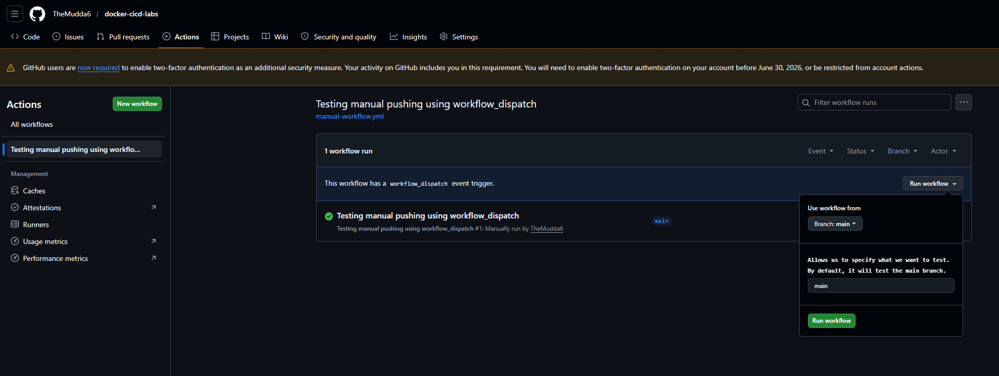

---

# Environment Protection Rules

A protected production environment was implemented using GitHub Environments.

The production environment requires manual approval before deployment stages can continue.

This simulates real-world enterprise deployment controls where:
- production pushes require authorization
- deployment actions are reviewed
- risky deployments can be stopped before release

This improves:
- operational safety
- governance
- deployment accountability
- production stability

---

# Protected Production Environment

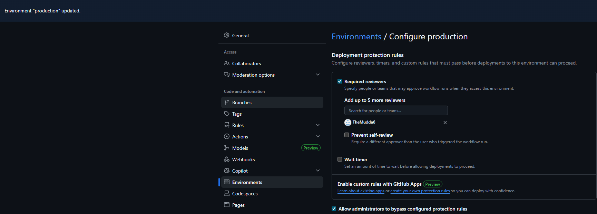

---

# Deployment Approval Workflow

The deployment process was intentionally paused awaiting manual approval before continuing into the deployment phase.

This demonstrated:
- deployment gating
- approval workflows
- production environment protection
- controlled release management

## Deployment Approval Pending

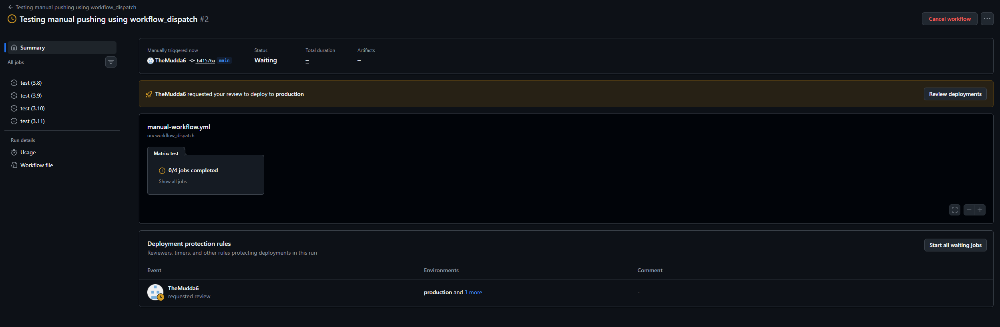

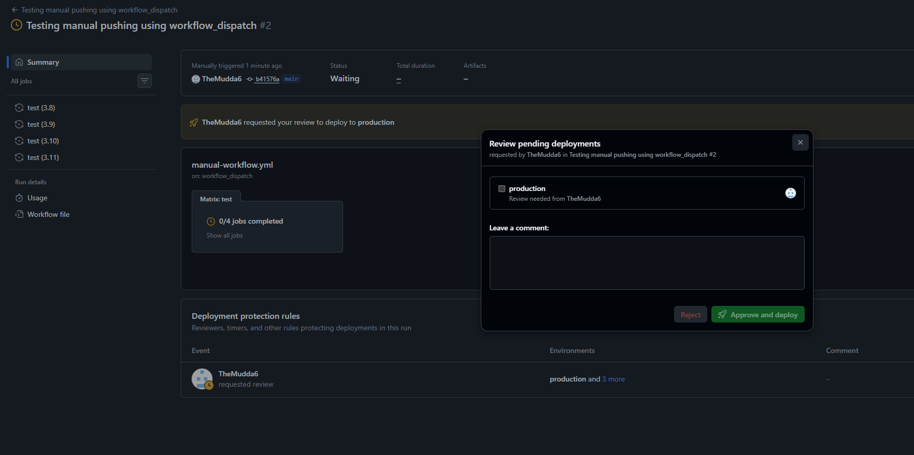

---

# Approved Deployment Execution

After manual approval was granted, the deployment workflow successfully continued through the remaining CI/CD stages.

## Approved Deployment

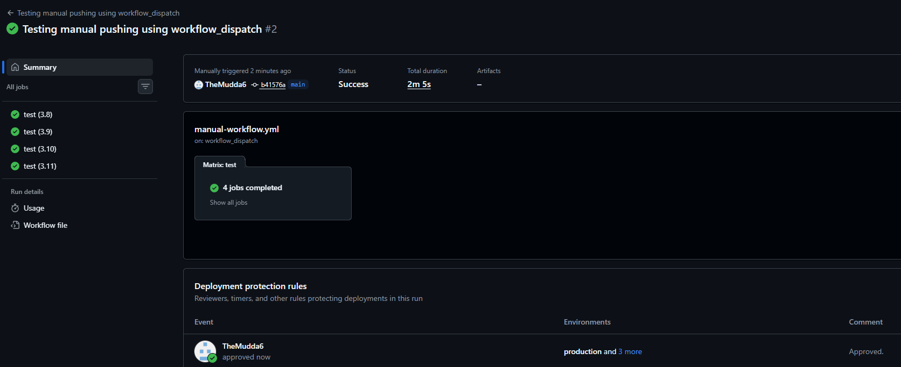

---

# GitHub Secrets & Secure Configuration Management

GitHub Secrets were implemented to avoid hardcoding sensitive information directly into source code or workflow files.

A deployment message secret was injected securely into the workflow during execution.

Benefits include:
- secret masking in logs
- reduced credential exposure
- safer collaboration practices
- improved operational security

This reinforces real-world DevOps security principles around:
- credential management
- secret rotation
- secure CI/CD workflows

---

# Secrets Management

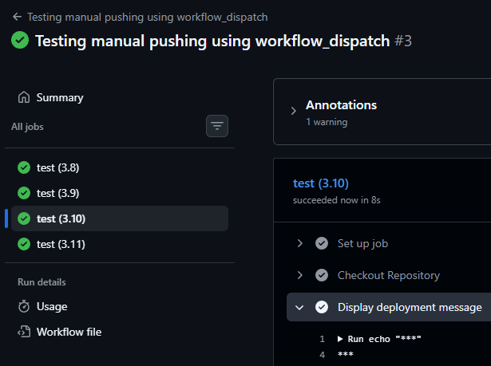

---

# Dependency Caching

Dependency caching was added using:

```yaml
cache: 'pip'
```

This allows GitHub Actions to reuse previously downloaded dependencies instead of reinstalling them during every workflow run.

Benefits include:
- reduced execution time
- lower bandwidth usage
- faster workflow completion
- improved CI efficiency

---

# Cache Restore Validation

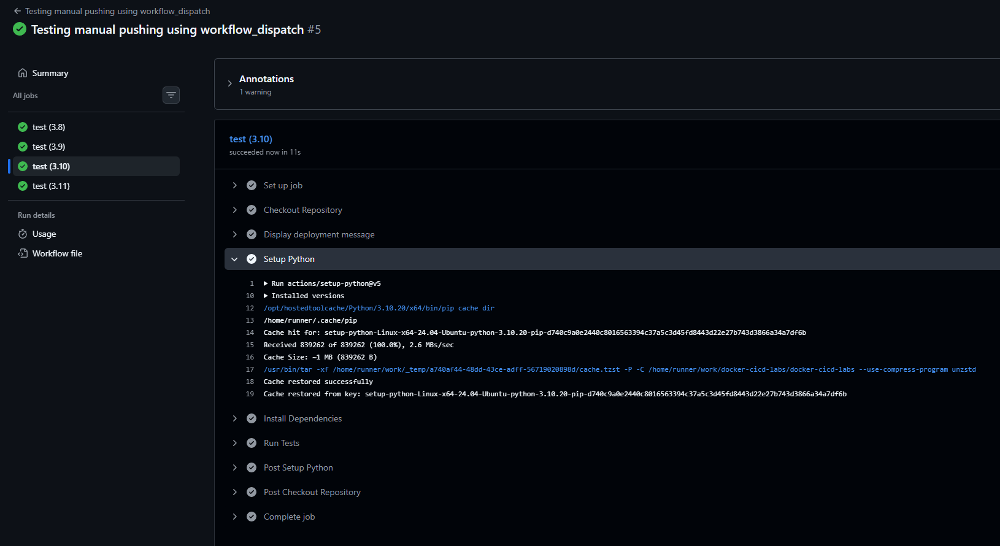

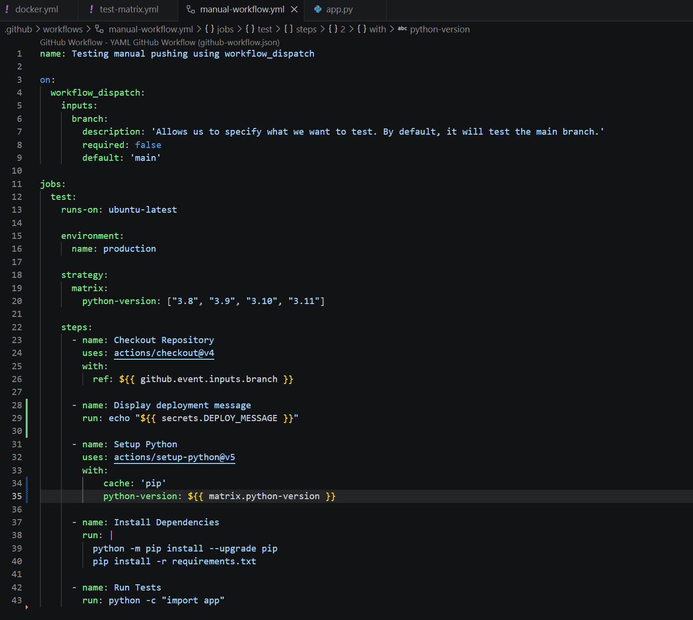

---

# Workflow Artifacts & Deployment Logging

The workflow was expanded to generate deployment logs and upload them as artifacts.

This creates:
- deployment traceability
- operational audit history
- troubleshooting evidence
- reproducible workflow records

Artifact management is an important DevOps practice because it leaves behind deployment evidence that can later be:
- reviewed
- audited
- downloaded
- shared
- analyzed during incident response

---

# Deployment Artifact Upload

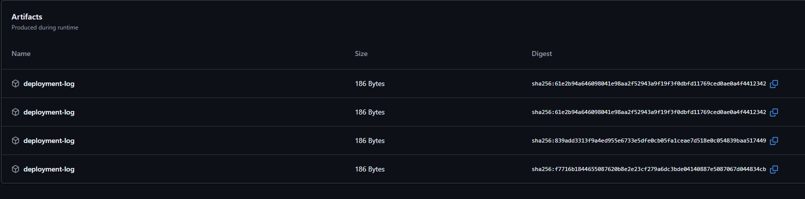

---

# Multi-Stage CI/CD Pipeline Orchestration

The workflow evolved into a structured multi-stage pipeline consisting of:

```text
test → build → deploy
```

using GitHub Actions job dependencies:

```yaml
needs:
```

This ensures:
- tests complete before builds begin
- broken code cannot deploy
- deployment order remains controlled
- production safety improves

This reflects real-world CI/CD orchestration patterns used in enterprise deployment pipelines.

---

# Pipeline Orchestration Workflow

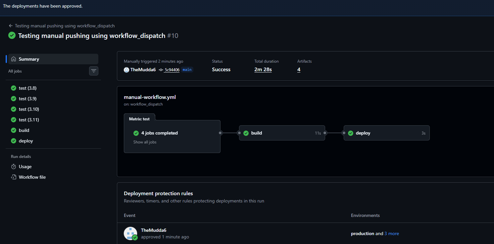

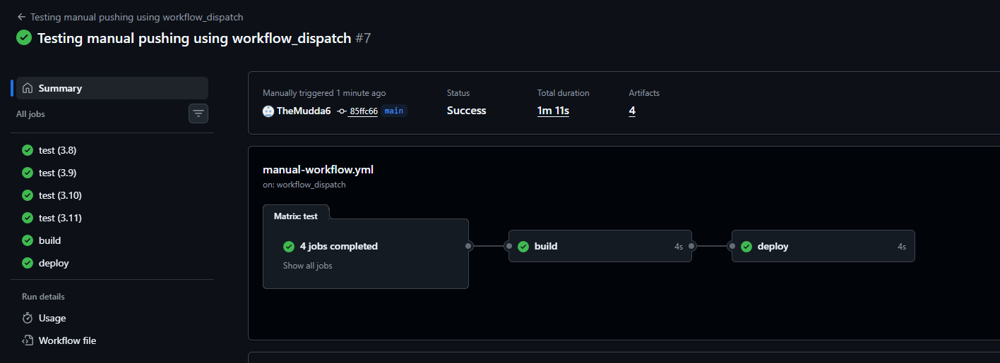

---

# Docker Build Automation & Version Tagging

The build stage was upgraded from a simulated deployment into a real Docker image build process using:

```yaml
docker build -t docker-cicd-labs:v1.${{ github.run_number }} .
```

This dynamically generates versioned Docker images during every workflow run.

Benefits include:
- reproducible builds
- release traceability
- rollback capability
- deployment version tracking

Using:

```yaml
${{ github.run_number }}
```

ensures every workflow execution produces a unique image tag.

---

# Docker Image Version Tagging

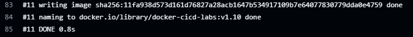

---

# Deployment Validation & Failure Prevention

The workflow structure was intentionally designed so deployment stages only execute after successful validation.

This helps prevent:
- broken builds reaching production
- failed application deployments
- unstable releases
- unnecessary downtime

Validation-first deployment strategies are critical because the further incorrect code progresses through deployment stages, the greater the operational impact becomes.

This reinforced important DevOps concepts such as:
- blast radius reduction
- deployment sequencing
- controlled rollout strategies
- rollback awareness
- production safety controls

---

# Expanded Concepts Learned

- GitHub Actions workflow_dispatch
- Environment protection rules
- Deployment approval gating
- GitHub Secrets management
- Secure CI/CD design
- Dependency caching
- Workflow artifacts
- Multi-stage pipeline orchestration
- Sequential deployment validation
- Docker image versioning
- Release traceability
- Build reproducibility
- Operational deployment safety
- Blast radius reduction
- Approval-based production workflows
- Deployment governance
- Rollback planning

---

# Final Outcome

This project evolved from a basic Dockerized Flask application into a significantly more advanced CI/CD pipeline demonstrating:

- matrix testing
- sequential workflow orchestration
- deployment approvals
- protected production environments
- secure secrets handling
- dependency caching
- workflow artifacts
- Docker image versioning
- deployment governance
- operational CI/CD practices

The final workflow now behaves much closer to real-world enterprise CI/CD systems used in modern DevOps environments.
